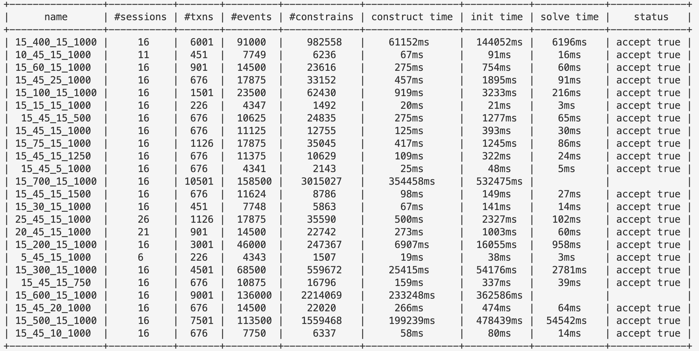
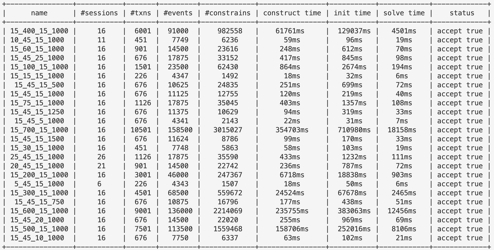

# SMT-Transactional-Consistency 做法和计划整理

<center>最后更新：2023-08-18</center>

## SER-checker

- [github repo](https://github.com/hengxin/smt-transactional-consistency-artifact)（未完全更新）
- 前端：解析 `dbcop` 生成的历史记录
- 后端：SMT Solver 求解，现有三个后端 `z3`、`monosat` 和 `acyclic-minisat`（实现较为粗糙）
- 示意图如下：


### `z3`

- 继承 `User Propagator`：（[参考资料](https://microsoft.github.io/z3guide/programming/Example%20Programs/User%20Propagator/)），重载 `push()`、`pop()` 和 `fix()`，在某一个变量被赋值的时候检查是否成环

### `monosat`

- 在调用 `monosat` 之前，求解器首先通过 `/utils/gnf.h` 中的 API `write_to_gnf_file()` 将其写入辅助文件 `monosat_tmp_input.gnf` 中 
- 将 `Monosat` 作为共享库使用，使用两个 API （`src/monosat/api/Monosat.h`）：
  - `readGNF()` ：从 `.gnf` 中读取约束
  - `solve()`：求解，因为编译的原因包装了 `solveWrapper()` 

#### `gnf` 格式

- 是 monosat 的输入格式，[文档](https://github.com/sambayless/monosat/blob/master/FORMAT.md)

- 大致继承自 `.cnf` :
  - 第一行为 `p cnf <#Vars> <#Clauses>` 。`<#Vars>` 表示 var 的数量（编号从 1 到 `<#Vars>`），`<#Clauses>` 表示 clauses 的数量。
  - 接下来有 `<#Clauses>` 行，每行是若干个整数 `v1 v2 ... vn 0` ，第 $i$ 行表示 $C_i = v_1 \lor v_2 \lor \cdots \lor v_n$ ，若 $v_j < 0$ ，则代表原来 $v_j$ 的位置上为 $\lnot v_j$ ，最后组成的 formula 是 $C_1 \land C_2 \land \cdots \land C_m$ 。
  - 接下来描述图结构和性质：
    - 有一行 `digraph <weight type> <#nodes> <#edges> <GraphID>` 描述图的信息。取 `<weight type>` 为 `int`（不关心边权），`<GraphId>` 为 `0`（只有一个图）。其中 `<#nodes>` 表示图中结点数量（编号从 0 到 `<#nodes>`），`<#edges>` 表示图中边数。
    - 接下来有 `<#edges>` 行，每行形如 `edge <GraphId> <from> <to> <CNF Variable> [<weight>]` ，其中 `<GraphId>` 取 `0` ，`<from>` 和 `<to>` 是图中结点的编号；`<CNF Variable>` 表示这条边绑定的 var 的编号（从 1 到文件第一行定义过的 `<#Vars>`），若 CNF 中的第 `<CNF Variable>` 个变量赋值为 `true`，则代表这条边存在，否则代表这条边不存在。
    - 接下来有若干行描述性质，只关心无环性 Acyclicity ，因此格式为 `acyclic <GraphId> <CNF Variable>` ，其中 `<GraphId>` 仍然取 0 ，`<CNF Variable>` 绑定 CNF 中的一个 var，若 CNF 中的第 `<CNF Variable>` 个变量被设为 `true` ，则认为该性质被满足。
- 例：

```gnf
p cnf 6 4
1 3 -4 0
4 0
2 -3 0
5 0
digraph int 3 4 0
edge 0 0 1 1
edge 0 1 0 2
edge 0 1 2 3 
edge 0 0 2 4
acyclic 0 6
```

#### Polygraph to GNF 的建模方法

PolyGraph 主要包含两部分：$known\_graph$ 以及 $constraints$。所有的 clause 可分为三部分：1、$known\_edge$ 中的边；2、$constraints$ 建模；3、acyclicity 。

##### 1. $known\_edge$ 中的边

在 monosat 的编码规则中，一条边绑定一个 CNF 中的 var，因此只要令这些 var 为 true 即可。

##### 2. $constraints$ 建模

一个 $constraints$ 可视为若干 $constraint$ 组成的集合，一个 $constraint$ 可定义为$(either, or)$ ，其中 $either$ 和 $or$ 均为边集，核心在于如何将“二选一”的模式编码为 CNF 范式。

对于每个 $constraint$ ：增加辅助的 var ，用 $A$ 和 $B$ 分别代表 $either$ 和 $or$ 集合是否加入图中，那么：

- $A$ 和 $B$ 必须满足“二选一”关系，即 $(A \land \lnot B) \lor (\lnot A \land B)$ ，CNF 范式为 $(A \lor B) \land (\lnot A \lor \lnot B)$ ，因此有两个 clause： $A \lor B$ 、$\lnot A \lor \lnot B$ 。

- 需要用 $A$ 和 $B$ 分别代替 $either$ 和 $or$ 集合中的情况，设 $binding(A, s)$ 表示用 var $A$ 绑定 $s$ 中的边，设 $s$ 中的边对应的 var 的集合为 $\{a_1, a_2, \ldots, a_n\}$ ，则 
  $$
  binding(A, s) := (A \to (a_1 \land a_2 \land \cdots \land a_n))  \land (\lnot A \to \lnot (a_1 \land a_2 \land \cdots \land a_n)) \\
  \begin{aligned}
  (A \to (a_1 \land a_2 \land \cdots \land a_n)) &= \lnot A \lor (a_1 \land a_2 \land \cdots \land a_n) \\
  &= (\lnot A \lor a_1) \land (\lnot A \lor a_2) \land \cdots \land (\lnot A \lor a_n)
  \end{aligned} \\
  \begin{aligned}
  (\lnot A \to \lnot (a_1 \land a_2 \land \cdots \land a_n)) &= A \lor \lnot(a_1 \land a_2 \land \cdots \land a_n) \\
  &= A \lor \lnot a_1 \lor \lnot a_2 \cdots \lor \lnot a_n
  \end{aligned}
  $$

> TODO：monosat 可能可以直接编码二选一的输入格式

##### 3. acyclicity

单独用一个 var 绑定然后将其设置为 true 即可。

### `acyclic-minisat`

#### 想法

- monosat 中除去 acyclicity ，还有支持很多其他 theory ，应当删繁就简
- 约束的形式 $A \lor B$ 和 $\lnot A \lor \lnot B$ 较好（2 SAT），而 $A \lor \lnot a_1 \lor \lnot a_2 \cdots \lor \lnot a_n $ 不太好，考虑仿效 zord ，将“把 $A$ 设为 true”赋予向图中添加边的语义，这样不仅约简了 var 的数量，而且将问题的约束转化为 2SAT 形式 
- 将 monosat 开盒以进一步改进

#### 观察


以上为 monosat 的 phdthesis 5.1 中针对图上问题对于 $T-propagate()$ 作出的特化，在仅有**一张图**、**一个需要支持的性质**（acyclicity）的前提下，可以进一步特化，观察到：

- 仅有一个 Graph $G$
- 只有一个 predicate $acyclic()$ ，这个 predicate 应该会被 unit propagation 第一步就约简掉，因此可以不将其视为一个 predicate
- 在上一步的前提下，$G^{+}$ 似乎没用。

现有的 $T-propagate()$ 如下：


这和 zord 还有我们之前做的事情（z3）似乎几乎一样，为什么 monosat 会变快？

猜想：z3 很复杂，monosat 比它简单，那么我们能不能做个更简单的？

于是，仿照 zord，在 minisat 的基础上改了一个

#### 设计

有了 $propagate()$ ，关键可能在于 $acyclic()$ 和 $analyze()$ 怎么设计，即判定环和找环的算法。

观察：图比较稀疏，且随着结点数量（事务数量）的增大，边可能呈现越来越稀疏的形式。

##### 细节 1

把 $known\_graph$ 和 $constraints$ 中的边全部加入到图中，然后删去所有不在强联通分量中的边（“桥”）。

##### 细节 1.1

在图中，边对应的类型（WW、WR、SO、RW）似乎不重要，但是这可能导致重边。

解决方案：给每一条边标上对应的 var id 作为 label（$known\_graph$ 中的边可标为 0 ），若标号相同，可直接认为边相同，label 在生成 conflict clause 时也需要。

##### 细节 1.2（TODO：实现它）

如果有一个 var 对应的边集为空，那么可以直接设为 true ，同时可以将其对应的另一个 var 设为 false（触发 unit propagation 或 manually）

如果删去了所有的“桥”，理想情况下图可能分裂成若干个大小比较均匀的子图，那么直接对于全图拓扑排序应当是很浪费的，还是选择 ICD algorithm。

为了保证找环的复杂度，将 ICD algorithm 发现的第一个环（上所有的非 0 label 排序去重之后）作为 conflict clause 返回。

> TODO：启发式算法，找一个更好的环（一般想法：让环上涉及到的 var 最少）

#### `agnf` 格式说明

目前 acyclic-minisat 采用这种输入格式。

第一行包含四个整数 $n, m, k, c$ ，分别表示图中结点数量（编号 $0$ 到 $n - 1$）、图中边的数量、$known\_graph$ 中边的数量，$constraint$ 的数量。

接下来有 $m$ 行，每行包含两个整数 $x, y$ ，表示图中有一条 $x \to y$ 的有向边，第 $i$ 条边的编号为 $i$ （$1 \leq i \leq m$），这 $m$ 行表示的边完全包含 $known\_graph$ 和 $constraints$ 中的边。

接下来有 $k$ 行，每行包含两个整数 $x, y$ ，表示 $known\_graph$ 中有一条 $x \to y$ 的有向边。

接下来有 $2c$ 行，每两行构成一个 $constraint$ ，分别表示 $either$ 和 $or$ 中的边集，格式相同，都为 `e1 e2 ... 0` ，表示这个边集对应的边的编号，以 $0$ 结尾。

#### 实现细节


#### 下一步工作

- 统计上述优化的效果（profiler，统计删去了多少桥边，统计并尝试 ICD algorithm 的 $\Delta$ 设为多少最好等等）。
- 想要进一步优化需要对于真实世界中的数据分布有更加细致的观察，我认为 cobra 中的 benchmark 具有一定代表性，但是他的格式和现有的格式不一样，转化较为繁琐，耗时应该不短。
- 设想在 $propagate()$ 中插入一种推导 conflict 的办法，这样就可以在现有的基础上进行一连串的 unit-propagation，压缩搜索树的深度，那么可能类似于 zord 中的 unit-edge propagation ，但是这种方法和找环本质上可能比较类似，所以这里应该存在一个算法之间的 tradeoff 。
  - 一种可能可行的办法，仅对于 DAG 中的部分边（链）进行推导，辅以搜索 + 找环，轻重链剖分可能是不错的办法，22 年有 NOI 集训队论文（djq）将轻重链剖分拓展到 DAG 上（但是是和 SAM 结合的，不知道有没有用）

## 运行时间统计

### monosat



#### acyclic-minisat



### z3


### 对比


## 相关资料

### 可能值得挖掘的图上算法

- DAG 上轻重链剖分：[DAG 链剖分](https://www.cnblogs.com/alex-wei/p/high_level_graph_theory.html)
- tarjan：做的过程中或许可以借鉴一些 tarjan 的信息减少开销（就像删去桥边）
- 动态树（森林）：动态树可以很方便快速地处理 link 和 cut 的操作，但是现有的动态树都是针对无向图的
  - link cut tree
  - top tree and finger tree

### SAT / SMT 搜索技巧

（还没开始看）

## 利用编码规则优化求解过程的可行方向：

1. SAT Solver 只需要猜 WW 的边，RW 不需要猜（RW 可能可以认为是 WW 的子集？）
2. 利用启发式规则优化 SAT Solver 的求解过程，即优化 `pick()` 选择一个赋值为 true 的 var 的过程
3. 在 `propagate()` 中，theory solver 可以尝试向图里面加入一条 WW 的边（类似于上面提到的 unit-edge propagation 操作），也可以尝试加入多条 WW 的边推出 conflict clause（目前认为可以尝试加两条，否则此步骤开销过大）